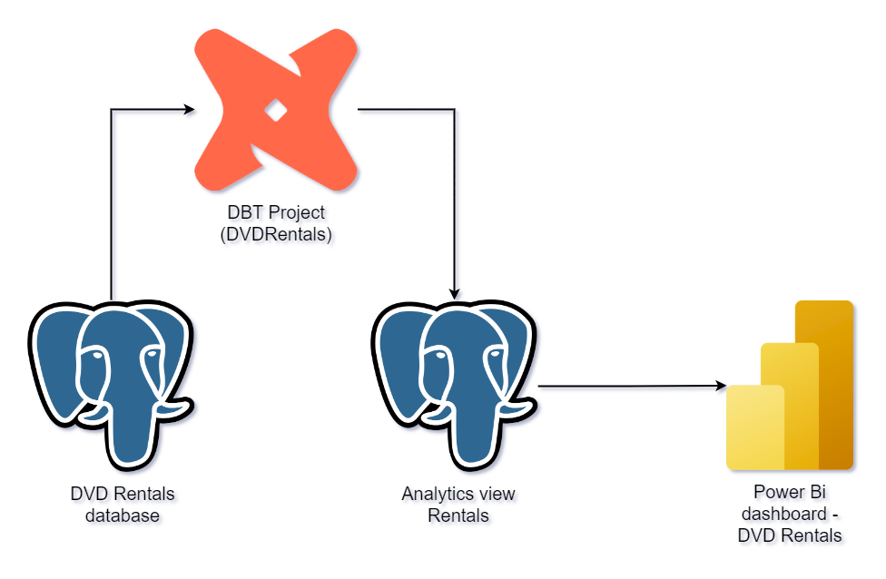
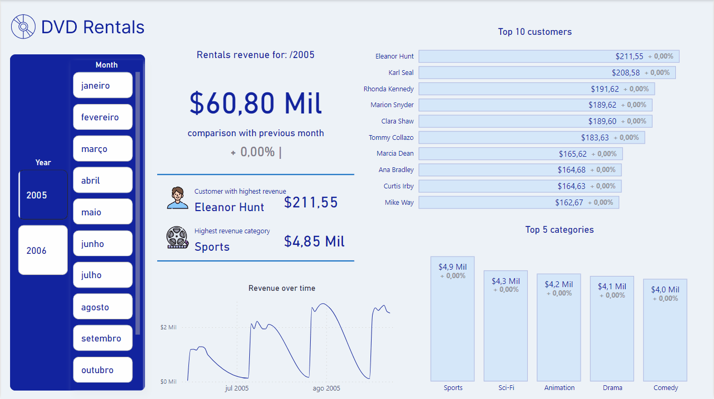
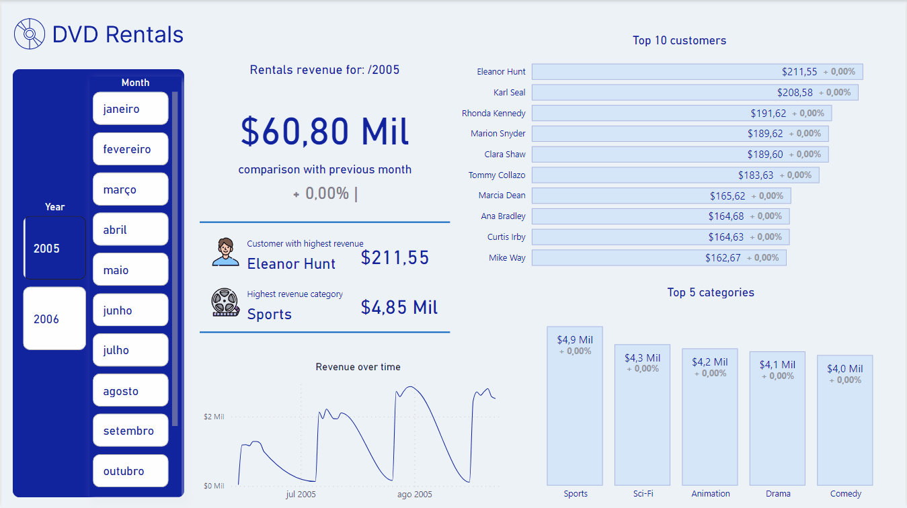

# DVD Rentals Power BI dashboard

### This is a Power BI dashboard created with the aim of using the views created in the [DVDRentals](https://github.com/TiagoBHeck/DVDRentals) project.

## Objective

#### This dashboard aims to highlight some of the most important features present in Power BI and also present how a data analysis project can be built starting from data extraction, creation of personalized views (using DBT) and import of the data model (view) into BI.

## About data transformation

#### The image below shows the data transformation flow
&nbsp;

## Dashboard main tab resources

### Time intelligence

#### In this panel, some time intelligence features are used when analyzing the data. The main feature here is the evaluation between the revenue of the selected month and the previous month, showing their variation.
&nbsp;

### Tooltips features

#### Tooltips in Power BI are some of the tool's main features to bring more quality to data analysis. Here it is possible to advance the individual customer and category analysis and obtain more detailed information about revenues within the selected period.

## Next steps

### This is the third dashboard in this data repository. The intention is to continue developing other more advanced work involving other data collection and transformation tools and subsequent construction of more elaborate dashboards.

## Author
- Tiago Bratz Heck
##### Access my [LinkedIn](https://www.linkedin.com/in/tiago-bratz-heck-0b9b5696/) profile.